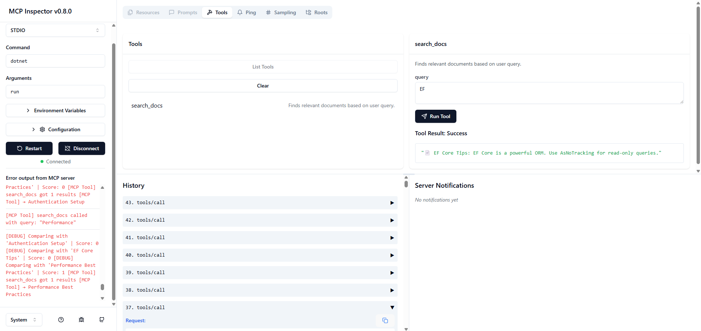
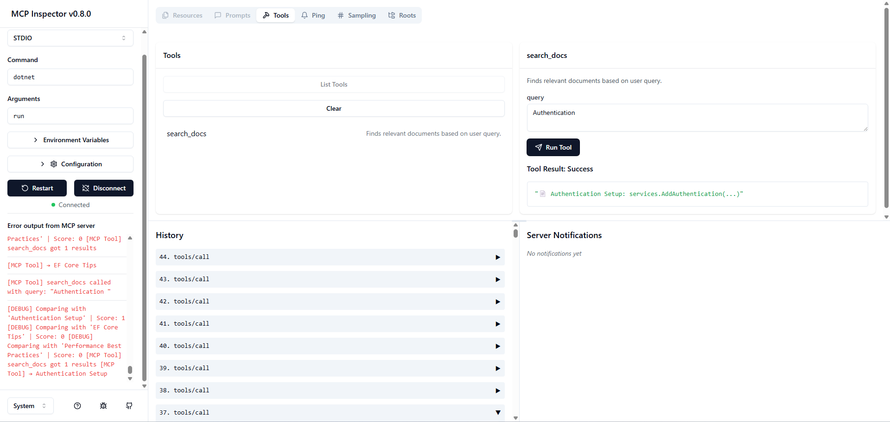
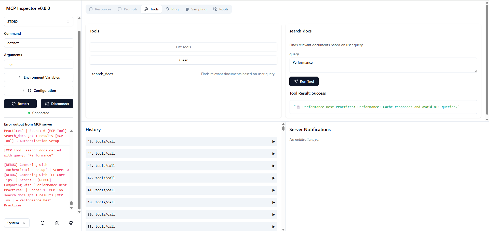

# McpMiniRagBridge

**McpMiniRagBridge** is a minimal, pluggable Retrieval-Augmented Generation (RAG) system built with .NET and integrated with the Model Context Protocol (MCP). It allows LLMs to search for relevant documents using vector similarity, enabling smarter responses grounded in your own content.

## What is this for?

This project is ideal for:

- Testing local RAG setups without heavy cloud dependencies.
- Prototyping tool-based LLM workflows with your own document corpus.
- Learning how vector search, embedding, and tool calls work in an LLM system.
- Integrating your backend with LLM frameworks using the MCP Inspector and tool API.

## Features

- Vector search via simple cosine similarity
- Embedding service mock (`DummyEmbedding`) for keyword-based testing
- Tool-based interface via MCP Inspector
- Minimal dependencies and easy to run
- Easily extendable to real embedding APIs (like OpenAI)

## Requirements

Make sure you have the following installed:

- .NET 8.0 SDK or higher: https://dotnet.microsoft.com/en-us/download
- Node.js: https://nodejs.org/
- Git (optional but useful)

## Project Structure

```
McpMiniRagBridge/
├── Data/
│   └── AppDbContext.cs
├── Services/
│   ├── IEmbeddingService.cs
│   ├── DummyEmbedding.cs
│   └── VectorSearch.cs
├── Tools/
│   └── DocumentSearchTool.cs
├── Program.cs
└── McpMiniRagBridge.csproj
```

## Getting Started

### 1. Clone the repo

```bash
git clone https://github.com/Lolluckt/McpMiniRagBridge.git
cd McpMiniRagBridge
```

### 2. Restore dependencies

```bash
dotnet restore
```

### 3. Run the backend (for MCP Inspector)

```bash
npx @modelcontextprotocol/inspector dotnet run
```

This will:

- Compile and run your .NET backend
- Launch the MCP Inspector in your browser
- Register the `search_docs` tool automatically
- Seed test documents into the local DB

You can now test queries like:
- "EF Core"
- "Authentication"
- "Performance"
- Partial matches like "auth" or "perf" will also work

## Integrating into Your Project

To integrate this logic into another .NET project:

1. Copy the following files:
   - `IEmbeddingService.cs`
   - `VectorSearch.cs`
   - `DummyEmbedding.cs` (or replace with a real embedding provider)
   - The tool class in `Tools/`

2. Register your services in `Program.cs`:

```csharp
builder.Services.AddDbContext<AppDbContext>();
builder.Services.AddSingleton<IEmbeddingService, DummyEmbedding>();
builder.Services.AddScoped<VectorSearch>();
```

3. Register the MCP tool in your tool manifest if using the MCP Inspector or OpenChatKit.

## Commands Summary

| Command                                       | Purpose                               |
|----------------------------------------------|---------------------------------------|
| `dotnet restore`                              | Restore NuGet packages                |
| `dotnet build`                                | Build the project                     |
| `dotnet run`                                  | Run the backend server                |
| `npx @modelcontextprotocol/inspector dotnet run` | Run backend and MCP Inspector        |
| `dotnet ef database update` (if needed)       | Apply migrations (EF Core)           |

## How It Works

1. Your documents are embedded using `IEmbeddingService`
2. Queries are embedded using the same logic
3. Cosine similarity is computed between the query vector and document vectors
4. The best-matching document (above a threshold) is returned

## Sample Output

Query: "EF Core"

Response:
```
EF Core Tips: EF Core is a powerful ORM. Use AsNoTracking for read-only queries.
```

Query: "Authentication"

Response:
```
Authentication Setup: services.AddAuthentication(...)
```

## Demonstration

Here are some examples of the application in use:

### Example 1


### Example 2


### Example 3



## Notes

- The `DummyEmbedding` is a mock — replace it with OpenAI, HuggingFace or custom vector logic for real use.
- MCP Inspector is used for testing tool calls with LLMs — no OpenAI key required to use the current setup.
- The document database uses EF Core and is seeded automatically on first run.

## License

Free to use and extend.

## Thanks

This project is inspired by:
- MCP Inspector
- LLM + Tooling + Retrieval demos
